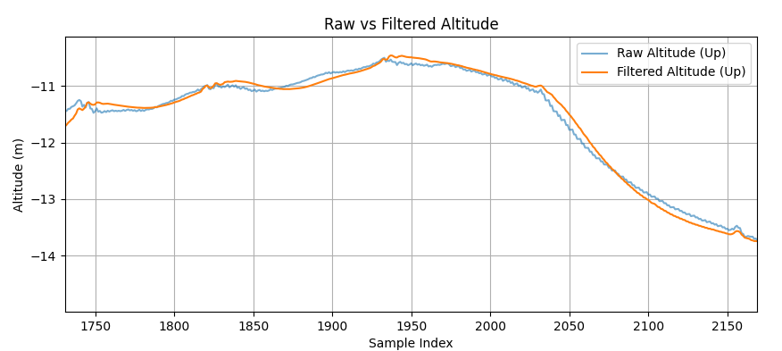
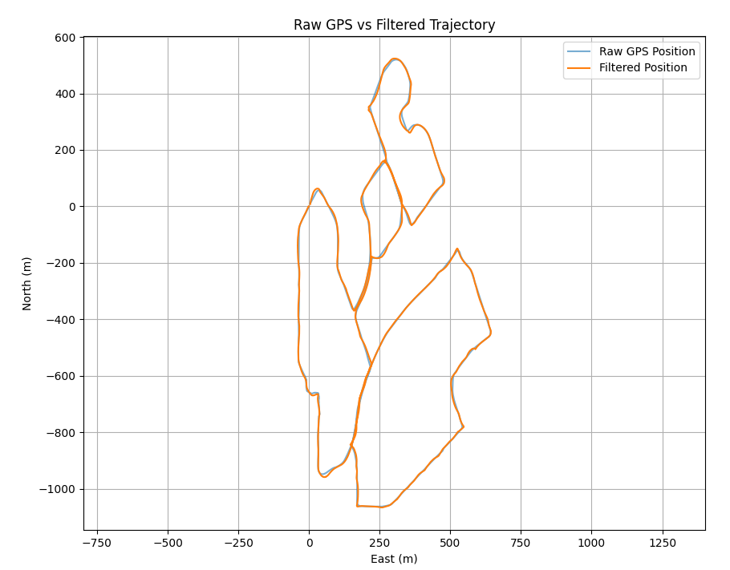

# Sensor Fusion for GPS and IMU using Extended Kalman Filter

---

## Introduction

This report presents a method for fusing GPS and IMU data using an Extended Kalman Filter (EKF). Geographic coordinates (LLH) are converted to a local ENU frame, and IMU-derived acceleration is used for motion prediction, while GPS updates correct the estimated state.

---

## Coordinate Conversion

To operate in a local Cartesian frame, GPS coordinates are transformed from LLH → ECEF → ENU.

```python
def llh_to_ecef(lat, lon, alt):
    lat_rad = np.radians(lat)
    lon_rad = np.radians(lon)
    N = a / np.sqrt(1 - e_sq * np.sin(lat_rad) ** 2)
    x = (N + alt) * np.cos(lat_rad) * np.cos(lon_rad)
    y = (N + alt) * np.cos(lat_rad) * np.sin(lon_rad)
    z = (N * (1 - e_sq) + alt) * np.sin(lat_rad)
    return np.array([x, y, z])
```

```python
def llh_to_enu(lat, lon, alt, lat_ref, lon_ref, alt_ref):
    x, y, z = llh_to_ecef(lat, lon, alt)
    enu = ecef_to_enu(x, y, z, lat_ref, lon_ref, alt_ref)
    return enu
```

---

## Kalman Filter Implementation

The EKF maintains a 6D state `[x, y, z, vx, vy, vz]` and is updated using inertial acceleration and GPS position.

### Jacobian (Linearization)

```python
def F_jacobian(self):
    dt = self.dt
    F = np.eye(6)
    F[0, 3] = dt
    F[1, 4] = dt
    F[2, 5] = dt
    return F
```

The Jacobian is used in the prediction step to propagate uncertainty in the nonlinear model.

### Prediction Step

```python
def predict(self, a):
    self.x = self.f(self.x, a)
    F = self.F_jacobian()
    self.P = F @ self.P @ F.T + self.Q
```

### Update Step

```python
def update(self, z):
    z = np.reshape(z, (3, 1))
    y = z - self.h(self.x)
    H = self.H_jacobian()
    S = H @ self.P @ H.T + self.R
    K = self.P @ H.T @ np.linalg.inv(S)
    self.x = self.x + K @ y
    self.P = (np.eye(6) - K @ H) @ self.P
```

---

## Results

### Raw vs Filtered Altitude



**Analysis:**  
Filtered altitude data shows a smoother trend than raw GPS. Sudden GPS jumps are reduced, and altitude changes follow a more continuous pattern.

---

### Raw GPS vs Filtered Trajectory



**Observations:**
- **Trajectory Consistency:** The filtered path closely follows GPS but with fewer jumps.
- **Stability:** The EKF maintains better heading consistency in straight-line segments.
- **Fusion Benefit:** The filter bridges GPS signal fluctuations using IMU.

---

## Conclusion

The fusion of GPS and IMU using an EKF significantly improves position estimates. The ENU conversion and acceleration-based prediction allow for smoother trajectories and robustness against noisy GPS measurements.

---
